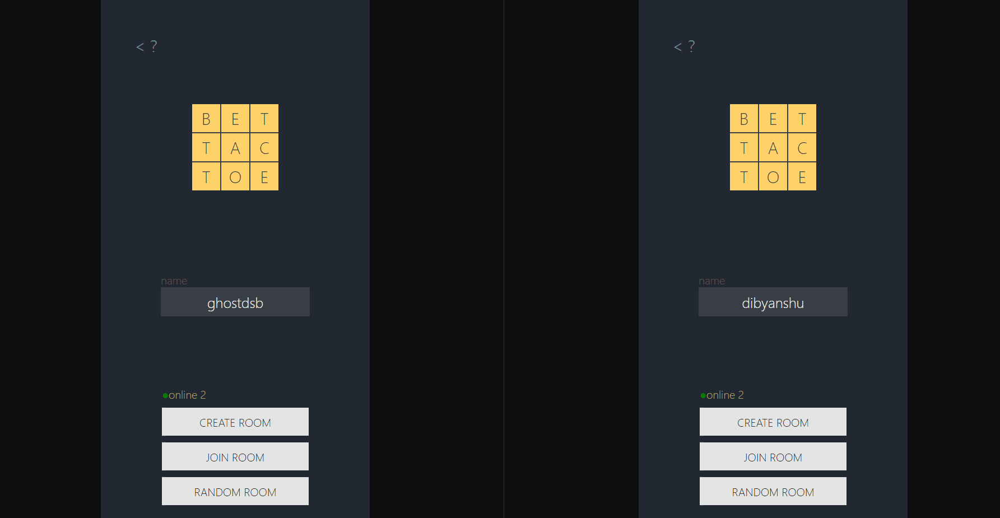
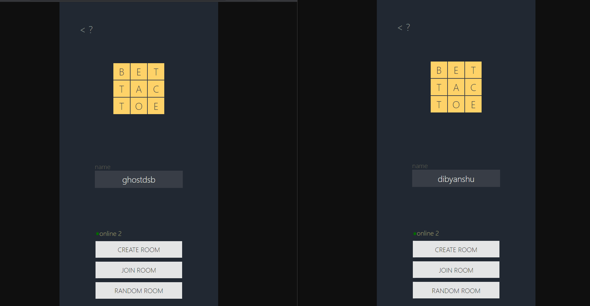

# BET TAC TOE

Tic Tac Toe, but you bet for your move.

Made with Elixir, Phoenix, Typescript, and React.

[PLAY WITH PEOPLE](https://ghostdsb.github.io/bettactoe "BET TAC TOE")

### Matchmaking : 
* CREATE ROOM
     Enter any room name and share with your friend to join.
* JOIN ROOM
     Join a room that is already created by your friend.
* RANDOM ROOM
     Randomly match with someone.

### Gameplay : 
* Both players place a bet for the turn.
* After placing bets, the one with the highest bet gets to move.
* In case of draw, one with lower total balance gets the chance.
* If draw persists, betting is done again.

### Random Matchmaking

### Matchmaking by creating a room

